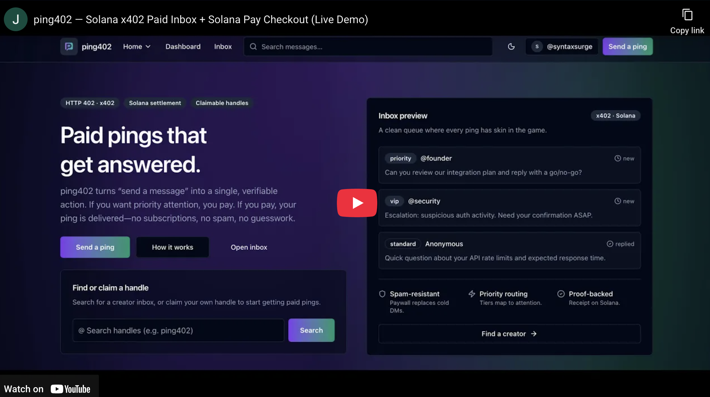

# ping402

[](https://pingx402.vercel.app/demo-video)

> **Paid pings that get answered.** A creator-paid inbox on **Solana** where **x402 (HTTP 402)** enforces pay‑per‑message delivery and **Solana Pay** settles **USDC** with a public on‑chain receipt.

**Live:** https://pingx402.vercel.app/  
**Demo video:** https://pingx402.vercel.app/demo-video  
**GitHub:** https://github.com/syntaxsurge/ping402

---

## What is ping402?

ping402 turns “send a message” into a single, verifiable action:

**pay → deliver → triage**

Creators publish a public inbox at `/u/[handle]` with tiered urgency (Standard / Priority / VIP).  
Senders pay via **Solana Pay**, get a **public receipt**, and the creator sees a clean, prioritized inbox.

---

## Why this matters

Creators, founders, support teams, and on-call engineers get flooded with low-signal inbound. ping402 flips the incentive:

- If you want priority attention, you **pay**.
- If you **pay**, your ping is **delivered** (provable on-chain).
- If you don’t pay, the endpoint stays behind **HTTP 402**.

This creates a simple, user-friendly “market for urgency” that’s easy to understand, easy to verify, and hard to spam.

---

## Message tiers (current)

- **Standard** — `$0.01`
- **Priority** — `$0.05`
- **VIP** — `$0.25`

Tiers are enforced by the x402 paywall and reflected in the Solana Pay checkout (asset, amount, pay-to).

---

## Hackathon alignment (Solana Winter Build Challenge 2025)

ping402 is built to be eligible for both tracks:

### Track — Best Consumer App on Solana

- **Clear audience + problem:** creators, founders, and teams overwhelmed by low-signal inbound.
- **Great UX:** search handle → pick tier → pay → receipt → inbox triage (no accounts/passwords).
- **Solana-native advantage:** fast settlement + verifiable receipts on-chain.
- **Practical consumer utility:** a simple market for attention and response urgency.

### Track — Best Use of x402 with Solana

- **x402 is the enforcement layer:** delivery is gated by HTTP `402 Payment Required` (not an add-on).
- **Solana is the proof + settlement layer:** payment occurs on Solana and is verifiable via the receipt.
- **API-first:** the paywalled endpoint is usable by web UIs, scripts, and agents that can speak x402.
- **Discovery support:** the app exposes x402 discovery resources for testing and integration.

---

## Quick walkthrough (for judges)

1. Claim a handle: `/owner-signin` (connect wallet + sign message).
2. Open your public inbox: `/u/[handle]`.
3. Choose a tier and pay via Solana Pay (connected wallet or QR).
4. After payment, the profile page shows a receipt link (`/r/[messageId]`) and the ping appears in `/inbox`.

Note: payments use USDC on the configured network (`X402_NETWORK`); you’ll also need SOL for fees. The checkout UI shows the exact mint, amount, and recipient.

---

## Core product flows

### Creator flow (get paid)

1. Connect a Solana wallet.
2. Claim a handle by signing a message (no SOL transfer): `/owner-signin`.
3. Share your public inbox: `/u/[handle]`.
4. Triage paid pings in `/inbox` and track revenue + status counts in `/dashboard`.

### Sender flow (pay to reach someone)

1. Search a creator handle: `/ping` (or open `/u/[handle]` directly).
2. Choose a tier (Standard / Priority / VIP).
3. Compose a ping and pay via Solana Pay (connected wallet or QR).
4. Receive a public receipt: `/r/[messageId]` with the payment transaction.

---

## How x402 + Solana power the product

ping402 is intentionally designed so **removing either x402 or Solana breaks the core promise**.

### x402: HTTP-native paywall + delivery guarantee

- Paid delivery is enforced by an **HTTP 402**-protected route:
  - `POST /api/ping/send?tier=[tier]`
- The server declares payment requirements (scheme, network, amount, pay-to). The request succeeds only after the client retries with proof in `PAYMENT-SIGNATURE`.
- x402 discovery is exposed via:
  - `GET /api/x402/discovery/resources`

### Solana: settlement + verifiable receipt

- Payments settle on **Solana** using the x402 **Exact SVM** scheme (USDC stablecoin by default).
- The UI uses **Solana Pay** so senders can pay via a connected wallet or QR code.
- Successful pings produce a public receipt page:
  - `GET /r/[messageId]`

---

## Tech stack

- Next.js 15 (App Router) + TypeScript (strict)
- Convex (realtime data + mutations/queries)
- Tailwind CSS v4 + shadcn/ui
- Solana Wallet Adapter + Solana Pay
- x402 v2 (HTTP 402, Exact SVM scheme, discovery extensions)

---

## Route inventory (high level)

### Pages

- `GET /` — marketing landing page (includes the embedded demo video)
- `GET /how-it-works` — redirects to `/#how-it-works`
- `GET /fund` — redirects to `/#funding`
- `GET /demo-video` — redirects to the configured demo video URL (`DEMO_VIDEO_URL`)
- `GET /pitch-deck` — redirects to the configured pitch deck URL (`PITCH_DECK_URL`, only when set)
- `GET /ping` — handle search + onboarding entrypoint
- `GET /u/[handle]` — public inbox profile page
- `GET /ping/[tier]` — compose page with in-app Solana Pay checkout
- `GET /r/[messageId]` — public receipt page (payment tx link)
- `GET /owner-signin` — creator handle claim/sign-in (Solana message signature)
- `GET /dashboard` — creator dashboard (requires creator session)
- `GET /inbox` — creator inbox (requires creator session)
- `GET /inbox/[messageId]` — message detail + status actions (requires creator session)

### API

- `POST /api/ping/send?tier=[tier]` — **x402-paywalled** ping delivery endpoint
- `POST /api/solana-pay/ping-intents` — create a Solana Pay checkout intent for a ping draft
- `GET /api/solana-pay/ping-intents/[intentId]` — poll + confirm Solana Pay payment for an intent
- `POST /api/solana-pay/ping-intents/[intentId]/consume` — consume an intent (creates the message)
- `GET /api/handles/lookup?handle=[handle]` — handle availability lookup (exact match)
- `GET /api/handles/search?query=[query]` — handle search + suggestions
- `GET /api/profiles/by-owner-wallet?walletPubkey=[walletPubkey]` — resolve wallet pubkey → claimed handle (if any)
- `POST /api/auth/nonce` — issue one-time sign-in nonce
- `POST /api/auth/verify` — verify signature, claim handle, set creator session cookie
- `POST /api/auth/signout` — clear creator session cookie
- `GET /api/x402/discovery/resources` — facilitator discovery proxy (HTTP resources)
- `GET /api/health` — health check JSON

---

## Local development

### Prerequisites

- Node.js 18+
- pnpm
- A Solana wallet (Phantom recommended)

### Install

```bash
pnpm install
```

### Configure environment variables

Copy the template and fill what’s required:

```bash
cp .env.example .env.local
```

**Required**

- `PING402_JWT_SECRET` — 32+ chars, signs the creator session cookie.

**Generated by Convex when you run dev**

- `NEXT_PUBLIC_CONVEX_URL`
- `CONVEX_DEPLOYMENT`

**Common optional**

- `NEXT_PUBLIC_SITE_URL` — absolute URLs for metadata routes (or rely on `VERCEL_URL`)
- `X402_NETWORK` — devnet: `solana:EtWTRABZaYq6iMfeYKouRu166VU2xqa1` / mainnet: `solana:5eykt4UsFv8P8NJdTREpY1vzqKqZKvdp`
- `X402_FACILITATOR_URL` — defaults to `https://x402.org/facilitator`
- `DEMO_VIDEO_URL` — powers the homepage embed and `/demo-video`
- `PITCH_DECK_URL` — optional redirect target for `/pitch-deck` (only enabled when set)

### Run the app

Single command (starts Next.js + Convex):

```bash
pnpm dev
```

Open:

- `http://localhost:3000` — landing
- `http://localhost:3000/ping` — find a creator / start sending
- `http://localhost:3000/owner-signin` — creator sign-in / claim handle
- `http://localhost:3000/inbox` — creator inbox
- `http://localhost:3000/r/[messageId]` — public receipt

---

## Reset Convex (optional)

`pnpm convex:reset` truncates all Convex tables for the current deployment.

Set `CONVEX_RESET_TOKEN` in `.env.local` before running it.

---

## Deployment (Vercel)

1. Import this repo into Vercel.
2. Set environment variables in Project Settings:
   - `NEXT_PUBLIC_CONVEX_URL`
   - `CONVEX_DEPLOYMENT`
   - `PING402_JWT_SECRET`
   - `DEMO_VIDEO_URL` (recommended)
   - `PITCH_DECK_URL` (optional)
   - `NEXT_PUBLIC_SITE_URL` (optional; or rely on `VERCEL_URL`)
3. Deploy.

---

## Learn more

- x402: https://www.x402.org/
- Coinbase x402 docs: https://docs.cdp.coinbase.com/x402/welcome
- Solana Pay: https://docs.solanapay.com/
